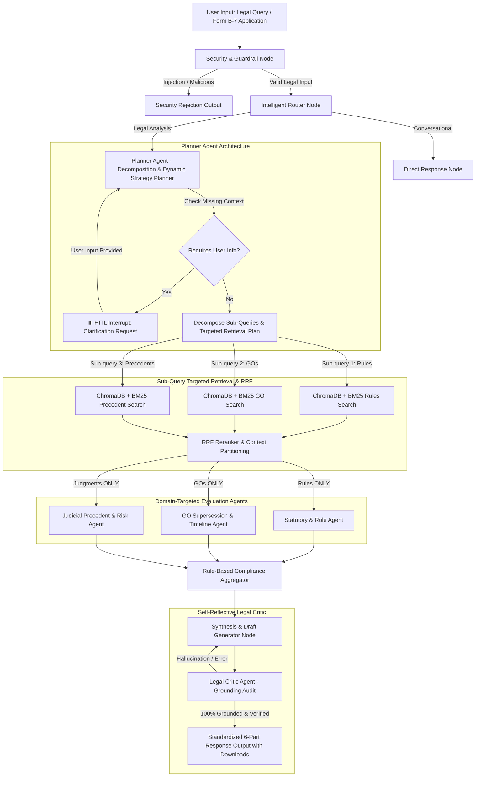

# Implementation Plan - Deep Agentic Government Legal Intelligence Assistant

Build a **Government Legal Intelligence Assistant** (AI Copilot) for Law & LSGD officers powered by an **Optimized Deep Agentic LangGraph Architecture**. The system features a **Planner Agent** that decomposes queries and orchestrates sub-query targeted retrievals, **Human-in-the-Loop (HITL) Clarification** for missing parameter requests, **Domain-Targeted Document Partitioning for Specialized Agents**, **Prompt Injection Guardrails**, **Hybrid RRF Search with Web Fallback**, and a **Self-Reflective Legal Critic Revision Loop** to minimize hallucinations and deliver transparent, cited, legal opinions.

---

## User Review Required

> [!IMPORTANT]
> **Streamlined Architecture**: The separate query cleaning node has been eliminated to reduce token cost and latency. Query decomposition, parameter checking, and sub-query planning are combined efficiently inside the **Planner Agent**.

> [!NOTE]
> **End-of-Workflow HITL Removed**: Final opinion generation produces the complete 6-part output directly with full citations and document download links without blocking at the end. HITL is reserved for parameter clarification when requested by the Planner.

---

## Optimized Deep Agent LangGraph Workflow Diagram



---

## Standardized 6-Part Output Specification

Every output returned by the system adheres strictly to the following 6-part structured layout:

1. **Issue Restatement**: Executive summary of the legal issue or permit application.
2. **Applicable Provisions**: Direct statutory rules, GO paragraphs, circulars with exact section/para numbers and inline `[SRC-X]` citation tags.
3. **Draft Analysis (AI-Generated — Requires Officer Review)**: Comprehensive legal interpretation, applying facts to rules.
4. **Compliance Risk Flags**: Severity-coded warnings (High/Medium/Low) highlighting missing mandatory approvals (e.g. SEIAA clearance under Sec 12(3)) and outdated GO citations.
5. **Sources Used (Citations & Download Links Table)**:
   - Citation Tag (`[SRC-1]`, `[SRC-2]`, etc.)
   - Document Name & Type
   - Clause / Section / Paragraph number
   - Page Number
   - Exact Quoted Snippet
   - Download / View Link (`/api/documents/download/{doc_id}`)
6. **Mandatory Officer Disclaimer**: Preserving officer review and human judgment.

---

## File Structure

```
AI Hackathon/
├── data/
│   └── mock_corpus/            # 6 mock legal documents & Form B-7 sample
│       ├── doc1_kerala_building_rules_2022.json
│       ├── doc2_go_p_45_2024_lsgd.json
│       ├── doc3_go_22_2021_lsgd.json
│       ├── doc4_circular_12_2025_env.json
│       ├── doc5_judgment_hc_1234_2023.json
│       └── sample_form_b7.json
├── app/
│   ├── config.py               # Model-agnostic config & Groq API settings
│   ├── guardrail.py            # Security & Prompt Injection Detector
│   ├── models/
│   │   ├── llm_factory.py      # Model-agnostic LLM factory (Groq / Ollama / OpenAI)
│   │   └── schemas.py          # Pydantic models
│   ├── services/
│   │   ├── document_loader.py  # Mock corpus auto-loader with page & clause metadata
│   │   ├── vector_store.py     # ChromaDB dense search
│   │   ├── hybrid_retriever.py # BM25 + Vector Search + RRF
│   │   ├── context_compressor.py # Document partitioning & noise reduction
│   │   ├── web_search.py       # Fallback web search integration
│   │   └── compliance_engine.py# Deterministic risk & missing approval checks
│   ├── graph/                  # Deep Agent LangGraph Workflow
│   │   ├── state.py            # Stateful schema with HITL thread state
│   │   ├── router.py           # Intelligent query router & document partitioning
│   │   ├── planner.py          # Planner Agent (Decomposition & Targeted Retrieval)
│   │   ├── agents.py           # Domain-partitioned agents (Statutory, GO, Precedent)
│   │   ├── critic.py           # Self-Reflective Legal Critic Agent
│   │   ├── nodes.py            # Node implementations & HITL interrupt handlers
│   │   └── workflow.py         # Stateful graph assembly with Checkpointer
│   ├── routes/
│   │   └── api.py              # FastAPI endpoints (/api/analyze, /api/resume, /api/documents/download/{id})
│   ├── static/                 # Split-Pane Web Dashboard (with HITL Modal & Agent Trace)
│   │   ├── index.html
│   │   ├── styles.css
│   │   └── app.js
│   └── main.py                 # FastAPI application entry point
├── tests/                      # Testing & Verification suite
│   ├── test_security_guardrail.py
│   ├── test_planner.py
│   ├── test_document_partitioning.py
│   ├── test_hitl_workflow.py
│   └── test_api.py
├── .env.example
├── requirements.txt
└── README.md
```

---

## Verification & Testing Plan

### Automated Tests
1. **Planner Agent Optimization Test**: Verify Planner Agent decomposes query into targeted sub-queries in a single call without separate query cleaning node.
2. **HITL Interruption & Resumption Test**: Verify clarification pauses when parameters are missing.
3. **Domain Partitioning Test**: Statutory agent gets *Rules*, GO agent gets *GOs*, Precedent agent gets *Judgments*.
4. **Critic Loop Test**: Verify hallucination prevention.
5. **Standardized 6-Part Output & Document Download Link Test**.
